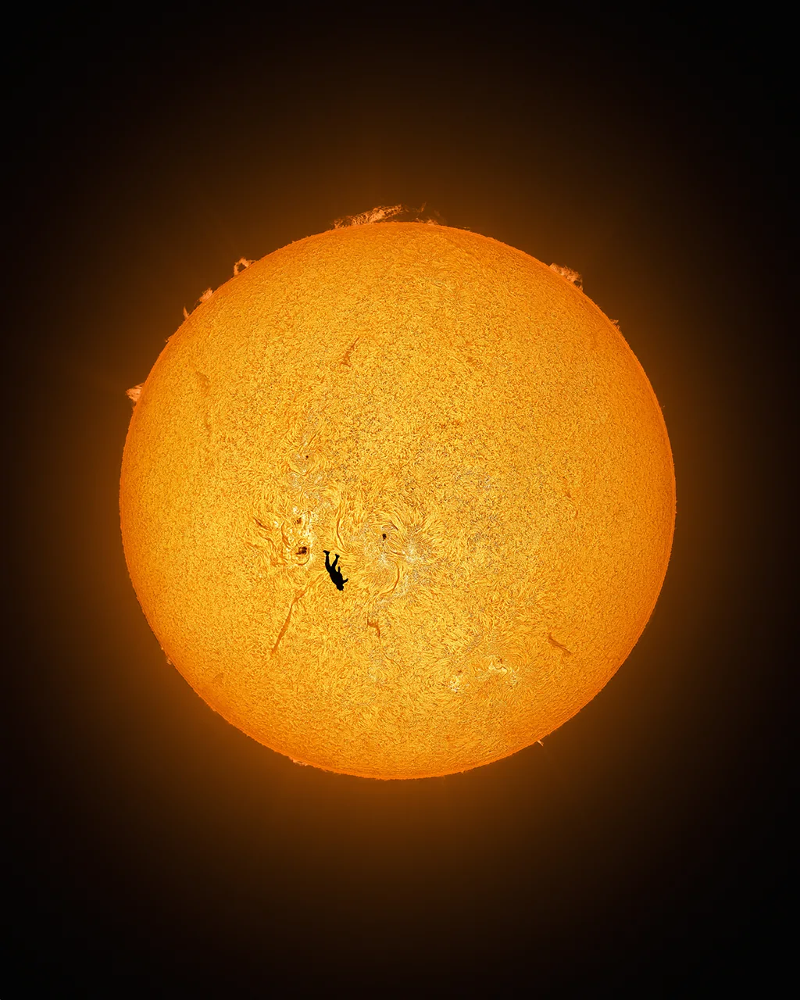

# Raimundo Varleta

**Ingeniero Civil en Biotecnología · Product Manager · AI Builder**

*Universidad de Chile, FCFM*

---

## Sobre mí

Ingeniero Civil en Biotecnología con mentalidad de Product Manager: foco en el usuario, orientación a resultados y capacidad de traducir necesidades complejas en iniciativas concretas. Mi formación científica me da base sólida en análisis cuantitativo, modelamiento de datos y comprensión de procesos técnicos, habilidades que aplico directamente en gestión de producto y desarrollo de soluciones end-to-end.

Experiencia práctica liderando producto en startups, coordinando equipos técnicos y comerciales, y construyendo plataformas que integran IA aplicada, datos y software.

> *"All models are wrong, but some are useful."* 

> *"In God we trust; all others must bring data."* 

---

## Stack

**Producto y datos**

**Desarrollo**

**Infraestructura y AI**

---

## Experiencia

**Cofundador · Product Design · Desarrollo Fullstack** · *Mercadote* · 2025
> Plataforma marketplace para el mercado chileno con IA integrada. Participé en la visión de producto, coordinación con equipo técnico y desarrollo fullstack con arquitectura monorepo (app móvil iOS/Android, dashboard analítico, backend API, landing multiidioma).

**Analista I+D / Ingeniero de Software** · *Bioelements Group* · oct 2024 jul 2025
> Gestor principal del proyecto **Cyllium IA**: plataforma de deep learning para predicción de biodegradabilidad y diseño de materiales en biopackaging sostenible. Pipelines de datos, modelos de ML y dashboards interactivos para decisiones de I+D.

**Investigador en Modelado Matemático** · *Núcleo Milenio MASH* · mar 2025 oct 2025
> Modelos mecanísticos (EDOs) para dinámicas biológicas en ecosistemas. Modelo predictivo de crecimiento de macroalgas con análisis de sensibilidad orientado a toma de decisiones.

---

## Proyectos

| Proyecto | Descripción | Stack |
|---|---|---|
| [**scrapeLLM**](https://github.com/rvarleta/scrapellm) | API serverless de web scraping con LLMs. Le das una URL y una instrucción en lenguaje natural, te devuelve JSON estructurado. | Python · AWS Lambda · Claude API · Playwright |
| [**PM Triage Tool con IA**](https://github.com/rvarleta/kunzapp-order-hub) | Herramienta de triage de pedidos con análisis IA integrado. Sistema de Product Ops con priorización RICE y automatización. | React · TypeScript · TanStack · Claude API |
| **Cyllium IA** | Plataforma de deep learning para evaluación de materiales biodegradables en la industria del biopackaging. | Python · Deep Learning · Visualización interactiva |
| **Tesis: Detección temprana de demencia** | Modelos predictivos con biomarcadores AT(N) para detección preclínica de Alzheimer. Machine learning sobre datos clínicos y epidemiológicos. | Python · scikit-learn · ML · Bioestadística |

---

## Educación

**Ingeniería Civil en Biotecnología** *distinción máxima*
Universidad de Chile, Facultad de Ciencias Físicas y Matemáticas (FCFM) · 2018 2025

Tesis enfocada en gestión de proyectos interdisciplinario y desarrollo de modelos predictivos para detección temprana de demencias. Integración de biomarcadores AT(N), machine learning y epidemiología.

---

## Lo que estoy construyendo ahora

- **scrapeLLM** - API serverless de scraping con LLMs sobre AWS Lambda, modos `crawl` y `agentic` en desarrollo
- **Lectio** - app que busca optimizar procesos educativos, desde la dinámica de clases hasta la búsqueda de docentes para procesos específicos
- **DataBond** - espacio digital que vincula entornos de desarrollo técnico con espacios comerciales para prospecciones e iteraciones de producto efectivas

---

**¿Trabajamos juntos?**

*Santiago, Chile · Inglés C1 · Disponible para roles de PM, Data o desarrollo*

